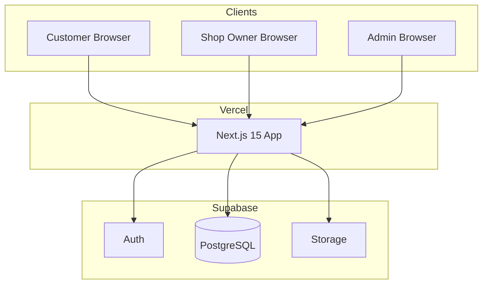

# Architecture — 시스템 아키텍처

## 1. 개요

AllBook은 **Next.js 15 App Router** 기반의 풀스택 웹 애플리케이션입니다. 데이터·인증·스토리지는 **Supabase**에 위임하고, 프론트엔드 호스팅은 **Vercel**에서 수행합니다.

본 문서는 수년간 운영·확장할 상용 서비스를 전제로, **기능 모듈화**, **역할 분리**, **업종 추상화**를 핵심 설계 원칙으로 합니다.

---

## 2. 설계 원칙

| 원칙 | 설명 |
|------|------|
| **Feature-first** | 비즈니스 도메인 단위로 코드를 분리 (`src/features/`) |
| **Thin routes** | `app/` 라우트는 조합(composition)만 담당, 로직은 feature로 위임 |
| **Type-safe data** | Supabase 스키마 ↔ TypeScript `Database` 타입 동기화 |
| **Security by default** | RLS + 서버 사이드 권한 검증, 클라이언트 신뢰 금지 |
| **Admin as first-class** | Admin Console을 별도 라우트·모듈로 초기부터 설계 |
| **Category-agnostic core** | Shop/Service/Booking은 업종 무관 공통 모델 |
| **Multi-Tenant by default** | 모든 비즈니스 데이터는 `tenant_id`로 격리, Tenant 이름 코드 하드코딩 금지 |

---

## 3. 시스템 컨텍스트



---

## 4. 기술 스택

| 레이어 | 기술 | 역할 |
|--------|------|------|
| UI | React 19, Tailwind CSS v4, shadcn/ui | 컴포넌트, 스타일 |
| Framework | Next.js 15 App Router | SSR, RSC, API Routes |
| Language | TypeScript (strict) | 타입 안전성 |
| Database | PostgreSQL (Supabase) | 영구 데이터 |
| Auth | Supabase Auth | 세션, OAuth |
| File | Supabase Storage | 샵 이미지 등 |
| Deploy | Vercel | CI/CD, Edge |
| DNS | allbook.com.au → Vercel | 프로덕션 도메인 |

---

## 5. 애플리케이션 레이어

```
┌─────────────────────────────────────────────────────────┐
│  app/ (Routes)          라우트·레이아웃·페이지 조합        │
├─────────────────────────────────────────────────────────┤
│  features/ (Domains)    비즈니스 로직·도메인 UI          │
├─────────────────────────────────────────────────────────┤
│  components/            공통 UI (ui/, common/)          │
├─────────────────────────────────────────────────────────┤
│  lib/                   Supabase, utils, 외부 연동       │
├─────────────────────────────────────────────────────────┤
│  types/ config/ hooks/  공유 타입·설정·훅               │
└─────────────────────────────────────────────────────────┘
```

---

## 6. 라우트 구조

고객 UI는 **영어**, Admin·Shop Dashboard는 운영 편의에 맞게 설계 (초기 영어, 필요 시 한국어 확장).

| Route Group | 경로 예시 | 대상 | UI 언어 |
|-------------|-----------|------|---------|
| `(public)` | `/`, `/shops`, `/shops/[slug]` | Customer | English |
| `(auth)` | `/login`, `/signup` | 전 역할 | English |
| `(account)` | `/account/bookings` | Customer | English |
| `(dashboard)` | `/dashboard`, `/dashboard/bookings` | Shop Owner, Staff | English |
| `(admin)` | `/admin`, `/admin/shops` | Admin | English (초기) |

### URL 설계 원칙

- RESTful·의미 있는 slug 사용 (`/shops/zen-massage-sydney`)
- Admin은 `/admin` prefix로 명확히 분리
- API Route Handler: `/api/v1/...` (버전 prefix 권장)

---

## 7. Feature 모듈

각 feature는 독립적인 **공개 API** (`index.ts`)를 가지며, 내부 구현은 캡슐화합니다.

```
src/features/<domain>/
├── components/       # 도메인 전용 UI
├── hooks/            # 도메인 전용 React 훅
├── actions/          # Server Actions
├── api/              # 도메인 API 헬퍼
├── types/            # 도메인 타입
├── utils/            # 도메인 유틸
└── index.ts          # 외부 export 진입점
```

### 도메인 목록

| 모듈 | 책임 |
|------|------|
| `tenants` | Tenant 식별, 브랜딩, 설정, slug 해석 |
| `auth` | 로그인, 역할, 세션, 프로필 |
| `shops` | 업체 정보, 영업시간, 슬러그, 카테고리 |
| `services` | 서비스 메뉴, 가격, 소요 시간 |
| `staff` | 직원, 근무 스케줄, 서비스 할당 |
| `booking` | 슬롯 계산, 예약 CRUD, 상태 머신 |
| `reviews` | 리뷰 (Phase 2) |
| `admin` | 플랫폼 관리, 승인, 통계, 감사 로그 |
| `notifications` | 이메일·푸시 (Phase 2) |

### 모듈 간 의존 규칙

- Feature → `lib/`, `types/`, `components/common` ✅
- Feature → 다른 Feature: **공개 API(`index.ts`)만** import ✅
- Feature 내부 구현 직접 참조 ❌
- `app/` → Feature 공개 API ✅
- Feature → `app/` ❌

---

## 8. 인증·인가

### 인증 (Authentication)

- **Supabase Auth**: 이메일/비밀번호, OAuth (Google 등)
- `@supabase/ssr`: 쿠키 기반 세션, `middleware.ts`에서 갱신
- 클라이언트: `lib/supabase/client.ts`
- 서버: `lib/supabase/server.ts`

### 인가 (Authorization)

| 계층 | 방식 |
|------|------|
| DB | PostgreSQL RLS — 역할·소유권 기반 |
| Server | Server Actions / Route Handler에서 `role` 재검증 |
| UI | 역할별 메뉴·라우트 가드 (보조 수단) |

### 역할 (`user_role`)

```
customer | shop_owner | staff | admin
```

- `profiles` 테이블에 `role` 저장 (Auth `users`와 1:1)
- Admin 권한 변경은 **서버 전용** + 감사 로그
- Shop Owner ↔ Staff 관계는 `shop_members`로 관리

### 미들웨어 흐름

```
Request → middleware (session refresh)
        → route group layout (role guard)
        → page / server action (RLS + server check)
```

---

## 9. 데이터 접근 패턴

| 패턴 | 사용처 |
|------|--------|
| **Server Components** | 목록·상세 조회 (캐싱 가능) |
| **Server Actions** | 폼 제출, 예약 생성, Admin 승인 |
| **Route Handlers** | Webhook, 외부 연동, 모바일 API (향후) |
| **Client Components** | 캘린더, 인터랙티브 UI |

### 캐싱 전략

| 데이터 | 전략 |
|--------|------|
| 샵 목록·상세 (공개) | ISR / `revalidate` |
| 예약 슬롯 | `no-store` (실시간) |
| Admin 통계 | 짧은 revalidate 또는 on-demand |

---

## 10. Admin Console 아키텍처

Admin은 **초기 개발 범위**이며, 다음과 같이 분리합니다.

```
src/
├── app/(admin)/
│   ├── layout.tsx          # Admin shell, role guard
│   ├── page.tsx            # Dashboard
│   ├── shops/
│   ├── users/
│   └── categories/
└── features/admin/
    ├── components/         # AdminTable, ApprovalBadge 등
    ├── actions/            # approveShop, suspendUser 등
    └── types/
```

### Admin 보안 요구사항

- `/admin/*` — `role === 'admin'` 미들웨어·레이아웃 이중 검증
- Admin Server Actions — `assertAdmin()` 유틸 필수
- RLS: Admin 전용 정책 또는 `service_role` (서버만, 클라이언트 노출 금지)
- 모든 Admin 변경 → `audit_logs` 기록

---

## 11. 업종 확장 아키텍처

업종은 **설정 데이터**로 취급하며, 코드 분기를 최소화합니다.

```typescript
// 개념 모델 (구현 시 types/ 참고)
BusinessCategory = 'massage' | 'beauty' | 'nail' | 'spa'
```

- `business_categories` 테이블: 코드, 표시명, 아이콘, 정렬, 활성 여부
- Shop은 `category_id` FK
- UI 라벨은 DB/설정에서 로드 (하드코딩 지양)
- 업종별 추가 필드는 `shops.metadata` (JSONB) 또는 `shop_attributes` 확장 테이블

---

## 12. 예약 도메인 (핵심)

### 상태 머신

```
pending → confirmed → completed
                   ↘ cancelled
```

### 슬롯 계산 (개념)

입력: Shop 영업시간, Staff 가용 시간, 기존 Booking, Service duration  
출력: 예약 가능 시간 목록

- 서버 사이드에서 계산 (클라이언트 조작 방지)
- 트랜잭션으로 동시 예약 충돌 방지 (DB constraint + locking)

---

## 13. 외부 연동 (현재·계획)

| 서비스 | Phase | 용도 |
|--------|-------|------|
| Supabase | 1 | DB, Auth, Storage |
| Vercel | 1 | Hosting, Preview |
| Resend / SendGrid | 2 | 예약 확인 이메일 |
| Stripe | 2 | 결제 |
| Sentry | 1~2 | 에러 모니터링 |

---

## 14. 환경 구분

| 환경 | URL | 용도 |
|------|-----|------|
| Local | localhost:3000 | 개발 |
| Preview | `*.vercel.app` | PR Preview |
| Production | allbook.com.au | 상용 |

환경 변수는 `src/config/env.ts`에서 검증합니다. `.env.example`을 단일 소스로 유지합니다.

---

## 15. 배포·CI/CD

```
GitHub (master) → Vercel Build → Production (allbook.com.au)
GitHub (PR)     → Vercel Preview
```

- DB 마이그레이션: Supabase CLI (`supabase/migrations/`)
- 타입 생성: `supabase gen types` → `src/types/database.ts`

---

## 16. 디렉터리 구조 (목표)

```
allbook/
├── docs/                    # 프로젝트 문서
├── supabase/
│   └── migrations/          # SQL 마이그레이션
├── public/
└── src/
    ├── app/
    │   ├── (public)/
    │   ├── (auth)/
    │   ├── (account)/
    │   ├── (dashboard)/
    │   ├── (admin)/
    │   └── api/v1/
    ├── components/
    │   ├── ui/
    │   └── common/
    ├── config/
    ├── features/
    │   ├── admin/
    │   ├── auth/
    │   ├── booking/
    │   ├── services/
    │   ├── shops/
    │   └── staff/
    ├── hooks/
    ├── lib/
    │   └── supabase/
    ├── middleware.ts
    └── types/
```

---

## 17. ADR (Architecture Decision Records)

주요 결정은 추후 `docs/adr/`에 번호를 부여해 기록합니다.

| ID | 결정 | 근거 |
|----|------|------|
| ADR-001 | Supabase 단일 백엔드 | Auth+DB 통합, RLS, 운영 비용 |
| ADR-002 | Feature 모듈 구조 | 장기 유지보수, 팀 확장 |
| ADR-003 | Admin 초기 포함 | 플랫폼 운영 불가피 |
| ADR-004 | 고객 UI 영어 고정 (Phase 1) | 호주 시장 타깃 |
| ADR-005 | 가격 센트(AUD) 정수 저장 | 부동소수점 오류 방지 |

---

## 18. 변경 이력

| 버전 | 날짜 | 변경 내용 |
|------|------|-----------|
| 1.0 | 2026-07 | 초안 작성 (기존 ARCHITECTURE.md 대체) |
