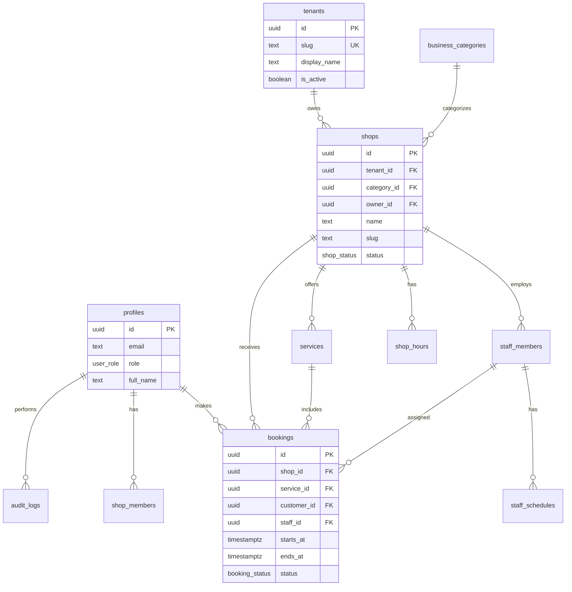

# Database — 데이터베이스 설계

## 1. 개요

AllBook의 영구 데이터는 **Supabase PostgreSQL**에 저장합니다. 본 문서는 스키마 설계, RLS 정책, 마이그레이션 전략을 정의합니다.

**설계 목표**

- **Multi-Tenant** — 모든 비즈니스 데이터는 `tenant_id`로 격리
- 업종 확장에 유연한 공통 모델
- 역할 기반 접근 제어 (RLS)
- 동시 예약 충돌 방지
- 감사 추적 (Admin 행위)

---

## 2. 네이밍 규칙

| 규칙 | 예시 |
|------|------|
| 테이블명 | snake_case, 복수형 (`shops`, `bookings`) |
| 컬럼명 | snake_case (`created_at`, `shop_id`) |
| PK | `id` (UUID, `gen_random_uuid()`) |
| FK | `{entity}_id` |
| 타임스탬프 | `created_at`, `updated_at` (timestamptz, UTC 저장) |
| 소프트 삭제 | `deleted_at` (필요 시) |
| 금액 | `price_cents` (integer, AUD) |
| Enum | PostgreSQL enum 또는 text + check constraint |

---

## 3. ER 다이어그램 (개념)



---

## 4. Enum 정의

### `user_role`

| 값 | 설명 |
|----|------|
| `customer` | 일반 고객 |
| `shop_owner` | 업체 운영자 |
| `staff` | 업체 직원 |
| `admin` | 플랫폼 관리자 |

### `shop_status`

| 값 | 설명 |
|----|------|
| `pending` | 입점 승인 대기 |
| `active` | 운영 중 |
| `suspended` | Admin 정지 |
| `closed` | 폐업/비활성 |

### `booking_status`

| 값 | 설명 |
|----|------|
| `pending` | 생성됨, 확정 대기 |
| `confirmed` | 확정 |
| `cancelled` | 취소 |
| `completed` | 완료 |
| `no_show` | 노쇼 |

### `service_status`

| 값 | 설명 |
|----|------|
| `active` | 예약 가능 |
| `inactive` | 비활성 |

---

## 5. 테이블 상세

### 5.0 `tenants` (Multi-Tenant 루트)

모든 비즈니스 데이터의 최상위 경계. DaySpa는 seed 데이터로만 존재하며 코드에 하드코딩하지 않습니다.

| 컬럼 | 타입 | 설명 |
|------|------|------|
| `id` | uuid PK | |
| `slug` | text UNIQUE | URL·서브도메인 식별자 (`dayspa`) |
| `name` | text | 내부 이름 |
| `display_name` | text | 고객 UI 표시명 |
| `tagline` | text | 브랜드 슬로건 |
| `logo_url` | text | 로고 이미지 |
| `primary_domain` | text | 대표 도메인 |
| `timezone` | text | 기본 `Australia/Sydney` |
| `currency` | text | 기본 `AUD` |
| `locale` | text | 기본 `en-AU` |
| `is_active` | boolean | |
| `settings` | jsonb | Tenant별 확장 설정 |
| `created_at` | timestamptz | |
| `updated_at` | timestamptz | |

**RLS**: 활성 Tenant는 공개 읽기 (브랜딩 해석용). 쓰기는 Platform Admin만.

---

### 5.1 `profiles`

Auth `auth.users`와 1:1 연동되는 애플리케이션 프로필.

| 컬럼 | 타입 | 설명 |
|------|------|------|
| `id` | uuid PK | `auth.users.id` FK |
| `email` | text | 이메일 |
| `full_name` | text | 이름 |
| `phone` | text | 연락처 (nullable) |
| `role` | user_role | 기본 `customer` |
| `avatar_url` | text | 프로필 이미지 |
| `created_at` | timestamptz | |
| `updated_at` | timestamptz | |

**트리거**: `auth.users` INSERT 시 `profiles` 자동 생성.

---

### 5.2 `business_categories`

업종 마스터. Admin이 관리.

| 컬럼 | 타입 | 설명 |
|------|------|------|
| `id` | uuid PK | |
| `code` | text UNIQUE | `massage`, `beauty`, `nail`, `spa` |
| `name` | text | 고객 UI 표시명 (English) |
| `description` | text | |
| `icon` | text | 아이콘 키 |
| `sort_order` | int | 정렬 |
| `is_active` | boolean | 노출 여부 |
| `created_at` | timestamptz | |

**시드 데이터 (Phase 1)**: `massage` only (`is_active = true`), 나머지는 `is_active = false`.

---

### 5.3 `shops`

| 컬럼 | 타입 | 설명 |
|------|------|------|
| `id` | uuid PK | |
| `tenant_id` | uuid FK → tenants | **필수** — Multi-Tenant 격리 |
| `owner_id` | uuid FK → profiles | 운영자 |
| `category_id` | uuid FK → business_categories | |
| `name` | text | 샵 이름 |
| `slug` | text UNIQUE | URL slug |
| `description` | text | |
| `phone` | text | |
| `email` | text | |
| `address_line1` | text | |
| `address_line2` | text | |
| `suburb` | text | |
| `state` | text | NSW, VIC 등 |
| `postcode` | text | |
| `country` | text | 기본 `AU` |
| `timezone` | text | 기본 `Australia/Sydney` |
| `status` | shop_status | |
| `cover_image_url` | text | |
| `metadata` | jsonb | 업종별 확장 필드 |
| `created_at` | timestamptz | |
| `updated_at` | timestamptz | |

**인덱스**: `slug`, `category_id`, `status`, `(suburb, state)`, GIN on `metadata` (필요 시).

---

### 5.4 `shop_members`

Shop Owner가 Staff를 초대·관리.

| 컬럼 | 타입 | 설명 |
|------|------|------|
| `id` | uuid PK | |
| `shop_id` | uuid FK | |
| `user_id` | uuid FK → profiles | |
| `role` | text | `owner`, `staff` |
| `is_active` | boolean | |
| `created_at` | timestamptz | |

UNIQUE (`shop_id`, `user_id`)

---

### 5.5 `services`

| 컬럼 | 타입 | 설명 |
|------|------|------|
| `id` | uuid PK | |
| `shop_id` | uuid FK | |
| `name` | text | |
| `description` | text | |
| `duration_minutes` | int | 소요 시간 |
| `price_cents` | int | AUD 센트 |
| `status` | service_status | |
| `sort_order` | int | |
| `created_at` | timestamptz | |
| `updated_at` | timestamptz | |

---

### 5.6 `staff_members`

| 컬럼 | 타입 | 설명 |
|------|------|------|
| `id` | uuid PK | |
| `shop_id` | uuid FK | |
| `user_id` | uuid FK → profiles (nullable) | 계정 연동 전 null 가능 |
| `display_name` | text | |
| `bio` | text | |
| `avatar_url` | text | |
| `is_active` | boolean | |
| `created_at` | timestamptz | |
| `updated_at` | timestamptz | |

---

### 5.7 `staff_services`

직원이 수행 가능한 서비스 (M:N).

| 컬럼 | 타입 | 설명 |
|------|------|------|
| `staff_id` | uuid FK | |
| `service_id` | uuid FK | |

PK (`staff_id`, `service_id`)

---

### 5.8 `shop_hours`

요일별 영업시간.

| 컬럼 | 타입 | 설명 |
|------|------|------|
| `id` | uuid PK | |
| `shop_id` | uuid FK | |
| `day_of_week` | int | 0=Sunday … 6=Saturday |
| `open_time` | time | |
| `close_time` | time | |
| `is_closed` | boolean | 휴무일 |

UNIQUE (`shop_id`, `day_of_week`)

---

### 5.9 `shop_closures`

임시 휴무 (공휴일, 리novation 등).

| 컬럼 | 타입 | 설명 |
|------|------|------|
| `id` | uuid PK | |
| `shop_id` | uuid FK | |
| `starts_at` | timestamptz | |
| `ends_at` | timestamptz | |
| `reason` | text | |

---

### 5.10 `staff_schedules`

직원 근무 시간 (요일별).

| 컬럼 | 타입 | 설명 |
|------|------|------|
| `id` | uuid PK | |
| `staff_id` | uuid FK | |
| `day_of_week` | int | |
| `start_time` | time | |
| `end_time` | time | |
| `is_off` | boolean | |

---

### 5.11 `bookings`

| 컬럼 | 타입 | 설명 |
|------|------|------|
| `id` | uuid PK | |
| `shop_id` | uuid FK | |
| `service_id` | uuid FK | |
| `customer_id` | uuid FK → profiles | |
| `staff_id` | uuid FK → staff_members (nullable) | |
| `starts_at` | timestamptz | |
| `ends_at` | timestamptz | |
| `status` | booking_status | |
| `notes` | text | 고객 요청 사항 |
| `cancelled_at` | timestamptz | |
| `cancellation_reason` | text | |
| `created_at` | timestamptz | |
| `updated_at` | timestamptz | |

**제약**

- `ends_at > starts_at`
- 동일 `staff_id` + 시간 겹침 방지 (exclusion constraint 또는 애플리케이션 + advisory lock)
- `price_cents` 스냅샷 컬럼 추가 권장 (`price_cents_at_booking`) — 가격 변경 추적

**인덱스**: `(shop_id, starts_at)`, `(customer_id)`, `(staff_id, starts_at)`, `(status)`

---

### 5.12 `audit_logs` (Admin)

| 컬럼 | 타입 | 설명 |
|------|------|------|
| `id` | uuid PK | |
| `actor_id` | uuid FK → profiles | |
| `action` | text | `shop.approve`, `user.suspend` 등 |
| `entity_type` | text | `shop`, `user`, `category` |
| `entity_id` | uuid | |
| `payload` | jsonb | 변경 전후 |
| `ip_address` | text | |
| `created_at` | timestamptz | |

Admin 전용 INSERT, 조회는 Admin만.

---

## 6. Row Level Security (RLS)

모든 public 테이블에 RLS를 **활성화**합니다.

### 정책 원칙

| 역할 | 접근 |
|------|------|
| `customer` | 본인 `bookings`, 공개 `shops`/`services` 읽기 |
| `shop_owner` | 소유 `shops` 및 하위 데이터 CRUD |
| `staff` | 소속 `shop` 예약 읽기 (제한) |
| `admin` | 전체 읽기/쓰기 (전용 정책) |
| `anon` | 활성 `shops`, `services` 공개 읽기만 |

### 헬퍼 함수 (예시)

```sql
-- 개념적 예시 (구현 시 migrations에 작성)
create function is_admin() returns boolean ...
create function owns_shop(shop_uuid uuid) returns boolean ...
create function is_shop_member(shop_uuid uuid) returns boolean ...
```

### 민감 작업

- Admin 권한 부여, Shop 승인: **Server Action + service_role** 또는 `security definer` 함수
- `service_role` 키는 서버 환경 변수만, 클라이언트 절대 노출 금지

---

## 7. Auth 연동

```
auth.users  ──1:1──  profiles
                         │
              ┌──────────┼──────────┐
              ▼          ▼          ▼
          bookings   shop_members  audit_logs (admin)
```

- 회원가입 기본 role: `customer`
- Shop Owner 등록: Admin 승인 또는 self-serve + `pending` 상태
- Staff 초대: Shop Owner가 이메일 초대 → 가입 시 `shop_members` 연결

---

## 8. 마이그레이션 전략

### 디렉터리

```
supabase/
├── config.toml
└── migrations/
    ├── 20260701000000_init_extensions.sql
    ├── 20260701000001_create_enums.sql
    ├── 20260701000002_create_profiles.sql
    ├── 20260701000003_create_shops.sql
    └── ...
```

### 규칙

1. **순방향만** — rollback은 새 migration으로 처리
2. **작은 단위** — 테이블·정책별 분리
3. **시드 분리** — `supabase/seed.sql` (로컬·스테이징용)
4. PR마다 migration 파일 리뷰 필수
5. 배포 후 `supabase gen types` → `src/types/database.ts` 갱신

### 명령어

```bash
supabase init
supabase db reset          # 로컬
supabase db push           # 원격 반영
supabase gen types typescript --project-id <id> > src/types/database.ts
```

---

## 9. 성능·확장 고려

| 항목 | 전략 |
|------|------|
| 슬롯 조회 | `(shop_id, starts_at)` 복합 인덱스, 필요 시 materialized view |
| 목록 검색 | suburb/state 인덱스, Phase 2에서 PostGIS 또는 full-text |
| 대용량 예약 | 파티셔닝 검토 (연도별) — Phase 3 |
| Connection | Supabase connection pooler (transaction mode) |

---

## 10. 백업·복구

- Supabase 자동 일일 백업 (플랜에 따름)
- 프로덕션 스키마 변경 전 스테이징 검증
- PITR(Point-in-Time Recovery) 플랜 검토

---

## 11. 데이터 보존·삭제

| 데이터 | 정책 |
|--------|------|
| 예약 기록 | 최소 7년 보존 (세무·분쟁 대비, 법무 검토) |
| 감사 로그 | 2년 이상 |
| 탈퇴 사용자 | PII 익명화, 예약은 법적 보존 |

---

## 12. Phase별 스키마 범위

| Phase | 테이블 |
|-------|--------|
| 1 (MVP) | profiles, business_categories, shops, shop_members, services, staff_members, staff_services, shop_hours, bookings, audit_logs |
| 2 | shop_closures, staff_schedules, reviews, notifications |
| 3 | payments, payouts, promotions |

---

## 13. 변경 이력

| 버전 | 날짜 | 변경 내용 |
|------|------|-----------|
| 1.0 | 2026-07 | 초안 작성 |
