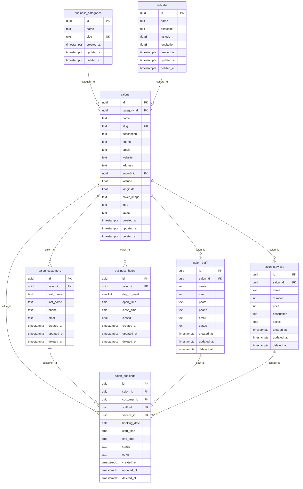

# Hair Booking Platform — MVP ER Diagram

Physical table names avoid collisions with the dayspa tenant (`public.staff`, `public.bookings`).

| Spec | Physical table |
|------|----------------|
| business_categories | `business_categories` |
| suburbs | `suburbs` |
| salons | `salons` |
| staff | `salon_staff` |
| services | `salon_services` |
| business_hours | `business_hours` |
| customers | `salon_customers` |
| bookings | `salon_bookings` |

## RLS (summary)

| Table | Public read | Public write |
|-------|-------------|--------------|
| business_categories | live rows | platform admin |
| suburbs | live rows | platform admin |
| salons | live + `status=active` | platform admin |
| salon_staff | live + active + salon active | service role |
| salon_services | live + active + salon active | service role |
| business_hours | live + salon active | service role |
| salon_customers | none (PII) | insert for booking |
| salon_bookings | live rows | insert pending/confirmed |

Soft delete: always filter `deleted_at IS NULL`.
